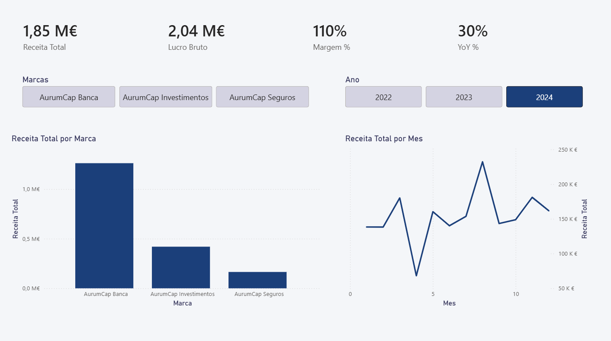
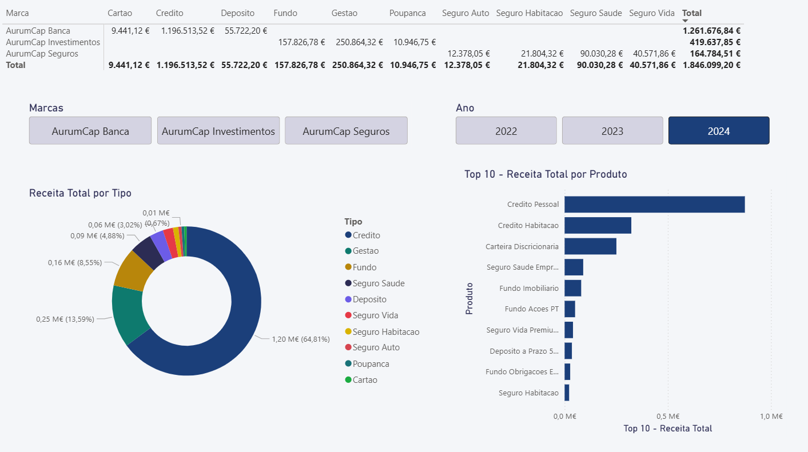
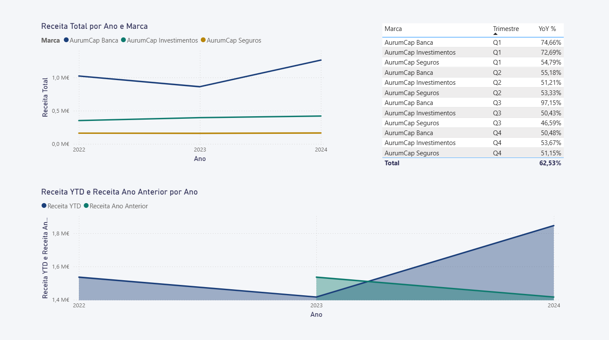

# AurumCap Grupo Financeiro
## Projeto de Análise de Dados — Portfolio Profissional

> **Simulação realista** de dados financeiros de um grupo fictício com 3 marcas,
> cobrindo 3 anos completos (2022–2024). Projeto completo para uso em portfolio de Data Analytics.

---

## Sobre o Projeto

O **AurumCap Grupo Financeiro** é uma empresa 100% fictícia criada para demonstrar competências em:
- Modelação e geração de dados financeiros realistas
- Análise de dados com Python (pandas, matplotlib, seaborn)
- Bases de dados relacionais com SQL (schema star, 20 queries analíticas)
- Dashboards Excel com múltiplos separadores de análise
- Relatórios profissionais em Word
- Apresentações executivas em PowerPoint
- Integração com Power BI (modelo de dados + DAX)

**Natureza dos dados:** 100% fictícios, criados com seeds controlados para reprodutibilidade.

---

## Estrutura do Projeto

```
financecorp-analytics/
│
├── dados/                          
│   ├── gerar_dados.py              
│   ├── marcas.csv                  
│   ├── clientes.csv                
│   ├── produtos.csv                
│   ├── transacoes.csv              
│   └── kpis_mensais.csv            
│
├── sql/
│   ├── 01_schema.sql              
│   └── 02_queries_analiticas.sql   
│
├── python/
│   └── analise_aurumcap.py          
│
├── outputs/                       
│   ├── 01_receita_anual_marca.png
│   ├── 02_evolucao_mensal.png
│   ├── 03_heatmap_margem.png
│   ├── 04_mix_produto.png
│   ├── 05_receita_cidade.png
│   ├── 06_kpi_cards_2024.png
│   ├── 07_crescimento_yoy.png
│   ├── 08_dashboard_geral_2024.png
│   ├── 09_dashboard_produto_2024.png
│   ├── 10_dashboard_crescimento_total.png
│   └── 11_dashboard_crescimento_Inv_Q2.png
│
├── excel/
│   └── dashboard_aurumcap.xlsx      
│
├── powerbi/
│   └── AurumCap_Power_BI.pbix           
│
├── relatorio/
│   └── AurumCap_Relatorio_Estrategico.pdf
│
├── apresentacao/
│   └── AurumCap_Apresentacao_Estrategica_2024.pdf 
│
└── README.md                       
```

---

## KPIs do Dataset

| Indicador | Valor |
|---|---|
| **Receita Total (2022–2024)** | €4.798.506 |
| **Lucro Bruto Total** | €2.035.151 |
| **Margem de Lucro Média** | 45,1% |
| **Total de Transações** | 2.800 |
| **Crescimento 2024 vs 2023** | +30,3% |
| **Período de dados** | Jan 2022 – Dez 2024 |

---

## KPIs do Dataset (ano 2024)

| Indicador | Valor |
|---|---|
| **Receita Total (2024)** | €1.846.099 |
| **Lucro Bruto Total** | €777.869 |
| **Margem de Lucro Média** | 45,1% |
| **Total de Transações** | 952 |
| **Crescimento 2024 vs 2023** | +30,3% |
| **Período de dados** | Jan 2024 – Dez 2024 |

---

## As 3 Marcas do Grupo

| Marca | Setor | Fundação | Produtos |
|---|---|---|---|
| **AurumCap Banca** | Banca de Retalho | 2001 | Crédito, Depósitos, Cartões |
| **AurumCap Seguros** | Seguros | 2005 | Vida, Auto, Habitação, Saúde |
| **AurumCap Investimentos** | Gestão de Ativos | 2010 | Fundos, PPR, Gestão Discricionária |

---

## Competências Demonstradas

**Dados e ETL**
- Geração de dados sintéticos realistas com distribuições controladas
- Sazonalidade simulada (Q4 com maior receita)
- Múltiplas entidades relacionadas (grupo, marcas, clientes, produtos)

**SQL**
- Schema relacional em star schema
- Queries com CTEs, window functions, ranking, YoY, running totals
- Modelação para OLAP e BI

**Python / Data Science**
- Análise exploratória completa
- Visualizações profissionais (barras, linhas, heatmap, donut, horizontal, KPI cards)
- Exportação para Excel com múltiplos separadores

**Business Intelligence**
- Modelo de dados compatível com Power BI
- Medidas DAX documentadas (tempo, ranking, AUM, crescimento)
- Dashboard estruturado em 5 páginas temáticas

**Comunicação de Dados**
- Relatório Word com gráficos embebidos
- Apresentação executiva PowerPoint com design profissional
- Narrativa de dados orientada a negócio

---
## Dashboard Power BI





---

## Aviso Legal

> Os dados, empresas, nomes, valores e métricas apresentados neste projeto são inteiramente fictícios.
> Criados exclusivamente para fins académicos e de demonstração em portfolio profissional.
> Qualquer semelhança com entidades reais é meramente coincidência.

---

*dms1996 · AurumCap Grupo Financeiro · Projeto de Portfolio · Data Analytics · Janeiro 2026*
