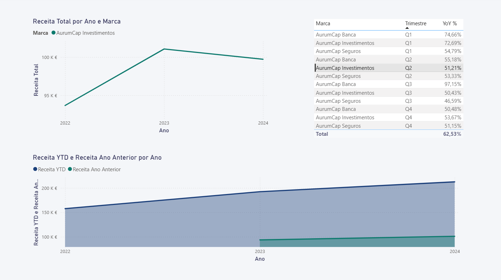

# AurumCap Financial Group
## Data Analytics Project — Professional Portfolio

> **Realistic simulation** of financial data for a fictional group with 3 brands,
> covering 3 full years (2022–2024). End-to-end analytics project for a Data Analytics portfolio.

> **Note:** Project content (scripts, reports, data files) is in Portuguese, reflecting the target market.

---

## About the Project

**AurumCap Financial Group** is a fully fictional company created to demonstrate skills in:
- Realistic financial data modelling and generation
- Data analysis with Python (pandas, matplotlib, seaborn)
- Relational databases with SQL (star schema, 20 analytical queries)
- Excel dashboards with multiple analysis tabs
- Professional reports in Word
- Executive presentations in PowerPoint
- Power BI integration (data model + DAX)

**Data nature:** 100% synthetic, created with controlled seeds for reproducibility.

---

## Project Structure

```
financecorp-analytics/
│
├── dados/                          # Data files
│   ├── gerar_dados.py              # Synthetic data generator
│   ├── marcas.csv                  # Brands
│   ├── clientes.csv                # Clients
│   ├── produtos.csv                # Products
│   ├── transacoes.csv              # Transactions
│   └── kpis_mensais.csv            # Monthly KPIs
│
├── sql/
│   ├── 01_schema.sql               # Star schema DDL
│   └── 02_queries_analiticas.sql   # 20 analytical queries
│
├── python/
│   └── analise_aurumcap.py         # Full analysis script
│
├── outputs/                        # Generated charts
│   ├── 01_receita_anual_marca.png
│   ├── 02_evolucao_mensal.png
│   ├── 03_heatmap_margem.png
│   ├── 04_mix_produto.png
│   ├── 05_receita_cidade.png
│   ├── 06_kpi_cards_2024.png
│   ├── 07_crescimento_yoy.png
│   ├── 08_dashboard_geral_2024.png
│   ├── 09_dashboard_produto_2024.png
│   ├── 10_dashboard_crescimento_total.png
│   └── 11_dashboard_crescimento_Inv_Q2.png
│
├── excel/
│   └── dashboard_aurumcap.xlsx     # Excel dashboard
│
├── powerbi/
│   └── AurumCap_Power_BI.pbix      # Power BI file
│
├── relatorio/
│   └── AurumCap_Relatorio_Estrategico.pdf  # Strategic report
│
├── apresentacao/
│   └── AurumCap_Apresentacao_Estrategica_2024.pdf  # Executive presentation
│
└── README.md
```

---

## Dataset KPIs (2022–2024)

| Metric | Value |
|---|---|
| **Total Revenue** | €4,798,506 |
| **Gross Profit** | €2,035,151 |
| **Average Profit Margin** | 45.1% |
| **Total Transactions** | 2,800 |
| **Unique Clients** | 42 |
| **2024 vs 2023 Growth** | +30.3% |
| **Data Period** | Jan 2022 – Dec 2024 |

---

## Dataset KPIs (2024)

| Metric | Value |
|---|---|
| **Total Revenue** | €1,846,099 |
| **Gross Profit** | €777,869 |
| **Average Profit Margin** | 45.1% |
| **Total Transactions** | 952 |
| **Unique Clients** | 608 |
| **2024 vs 2023 Growth** | +30.3% |
| **Data Period** | Jan 2024 – Dec 2024 |

---

## The 3 Group Brands

| Brand | Sector | Founded | Products |
|---|---|---|---|
| **AurumCap Banca** | Retail Banking | 2001 | Credit, Deposits, Cards |
| **AurumCap Seguros** | Insurance | 2005 | Life, Auto, Home, Health |
| **AurumCap Investimentos** | Asset Management | 2010 | Funds, PPR, Discretionary Management |

---

## Skills Demonstrated

**Data & ETL**
- Realistic synthetic data generation with controlled distributions
- Simulated seasonality (Q4 with highest revenue)
- Multiple related entities (group, brands, clients, products)

**SQL**
- Star schema relational design
- Queries with CTEs, window functions, ranking, YoY, running totals
- OLAP and BI-ready modelling

**Python / Data Science**
- Full exploratory data analysis
- Professional visualisations (bar, line, heatmap, donut, horizontal, KPI cards)
- Excel export with multiple tabs

**Business Intelligence**
- Power BI-compatible data model
- Documented DAX measures (time intelligence, ranking, AUM, growth)
- Dashboard structured across 5 thematic pages

**Data Communication**
- Word report with embedded charts
- Executive PowerPoint presentation with professional design
- Business-oriented data storytelling

---

## Power BI Dashboard




---

## Disclaimer

> All data, companies, names, values and metrics presented in this project are entirely fictional.
> Created exclusively for academic purposes and professional portfolio demonstration.
> Any resemblance to real entities is purely coincidental.

---

dms1996 *AurumCap Financial Group · Portfolio Project · Data Analytics · January 2025*
